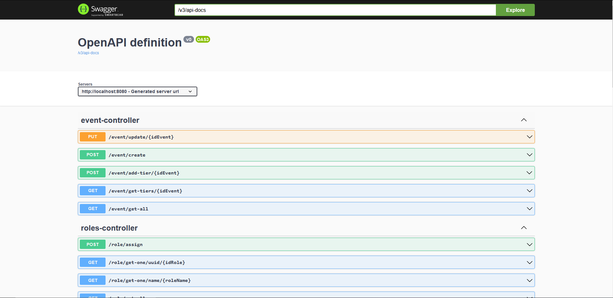

<div id="top"></div>

<!-- PROJECT LOGO -->
<br />
<div align="center">
  <h1 align="center">Ticket Plus</h1>
  
</div>

<!-- ABOUT THE PROJECT -->
## Sobre el Proyecto
<p align="justify">
El sistema a realizarse será uno que se enfoque en la venta de tickets para eventos culturales, sean estos de arte, música, cine, danza, etc, con el propósito de poder facilitar la compra de ellos. Asimismo, se requiere que el sistema no solo sea capaz de hacer compras de tickets, sino que también sirva para promover las varias actividades y eventos que el cliente ofrece y ha ofrecido anteriormente. Además de eso, el sistema debe poder utilizarse de una manera administrativa: tanto como en manejo de boletos durante eventos y en la creación de eventos en sí, en otras palabras: que tenga varios propósitos dependiendo del uso necesario en el momento y la persona que lo esté utilizando. Por ende, el sistema sirve varios propósitos: venta de tickets, administración y exposición de eventos y manejo de tickets.
</p>

<!-- SERVER -->
## Sobre la requisitos de Software

<p align="justify">A continuacion, se detalla el software necesario para ejecutar el Proyecto:</p>

### Frontend

<ul>
  <li><code>node</code>:<code>v18.16.1</code></li>
  <li><code>npm</code>:<code>v9.7.2</code></li>
</ul>

```bash
$ npm install
$ npm run dev
```

### Backend

<ul>
  <li><code>Java</code>:<code>openjdk-17-jdk</code></li>
  <li><code>Gradle</code>:<code>7.4.2</code></li>
</ul>


```bash
// Run application using Gradle
$ gradle bootRun

// Deploy Spring boot application
$ gradle build
$ java -jar /build/libs/TicketPlus-0.0.1.jar

```

## Sobre las credenciales y otras variables de sistema importantes

<p align="justify"> En la carpeta raíz del proyecto, crear un archivo llamado: <code>env.properties</code>, en el cual guardará lo siguiente:</p>

```html
DB_DATABASE=<NameOfYourDB>
DB_USER=<YourDBConnectionUsername>
DB_PASSWORD=<YourDBConnectionPassword>

Client_ID=<YourGoogleClientID>
Client_secret=<YourGoogleClientSecret>

Login_User_SMTP=<YourEmailSMTP>
Login_password_SMTP=<YourEmailPassword>

Verify_Frontend_URL=<YourFrontendVerificationURL>
```

## Sobre la documentación de la API

<p align="justify"> Una vez el proyecto sea ejecutado, ya sea en Producción o Deploy, visitar la siguiente ruta para obtener la definición de las rutas dentro de la Aplicación:</p>

```html
<YourServerURL>/swagger-ui/index.html
```

<p align="justify">Vista general de OpenAPI definition:</p>



<p align="justify">Vista de una Ruta por Controlador:</p>


<p align="justify">Vista general Schemes (DTOs) que reciben información:</p>


<p align="justify">Además, dentro de <code>./Documents/</code> se puede encontrar el documento <code>Insomnia.json</code> con todas las distintas rutas y probarlas en el Backend:</p>


<!-- LICENSE -->
## Licencia

Distribuido bajo la licencia MIT. Consulte `LICENSE.md` para obtener más información.

<!-- CONTACT -->
## Contacto

ERNESTO JOSE CANALES GUILLEN - 00051120@uca.edu.sv

CHRISTIAN JOEL LOPEZ ORTEGA - 00179320@uca.edu.sv

DIEGO ALEJANDRO GASTEAZORO COEN - 00315919@uca.edu.sv

OSCAR ALEXANDER CORNEJO VALSSE - 00223019@uca.edu.sv